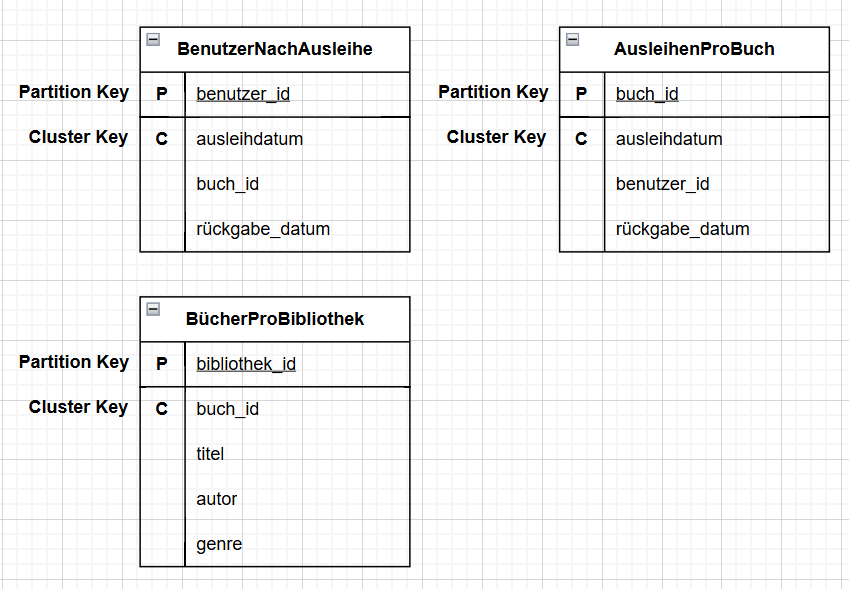

# A) Installation / Account erstellen

1. Screenshot der zeigt, dass die Verbindung mit cqlsh funktioniert.

# B) Logisches Modell für Cassandra

1. Eine visuelle Darstellung des logischen Datenmodells.

3. Erklärung zu den Abläufen und welche Daten benötigt werden.

Das logische Modell wurde aus dem konzeptionellen Modell abgeleitet und in Abfrage-orientierte Tabellen überführt.
Cassandra erlaubt keine Joins, daher wird jede Abfrage durch eine separate Tabelle abgebildet.

- In 'BenutzerNachAusleihe' kann man sehen, was ein Benutzer ausgeliehen hat.

- 'AusleihenProBuch' zeigt, wer ein Buch ausgeliehen hat.

- 'BücherProBibliothek' listet alle Bücher einer Bibliothek.
Die Partition Keys wurden so gewählt, dass die Anfragen performant bleiben. Redundanz ist in Cassandra gewünscht, da sie schnellere Abfragen erlaubt.

# C) Physisches Modell für Cassandra

[Skript](cassandrakn01.cql)
