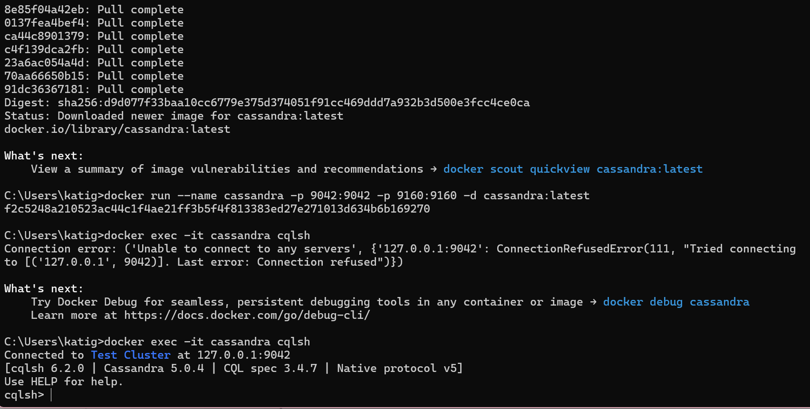

# A) Installation / Account erstellen

Screenshot der zeigt, dass die Verbindung mit cqlsh funktioniert.

# B) Logisches Modell für Cassandra

Eine visuelle Darstellung des logischen Datenmodells.

Erklärung zu den Abläufen und welche Daten benötigt werden.

