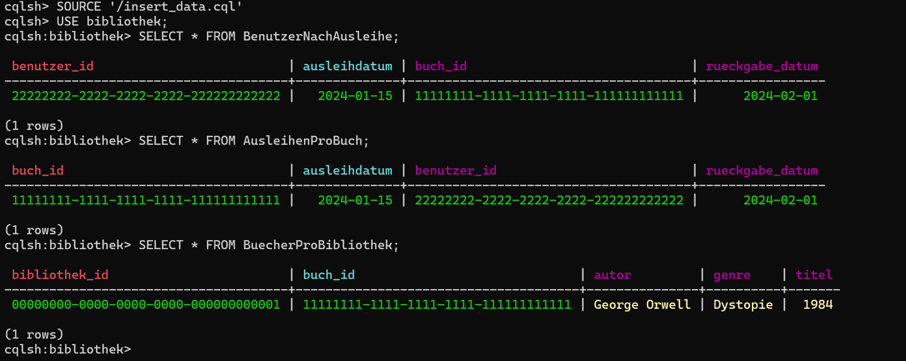
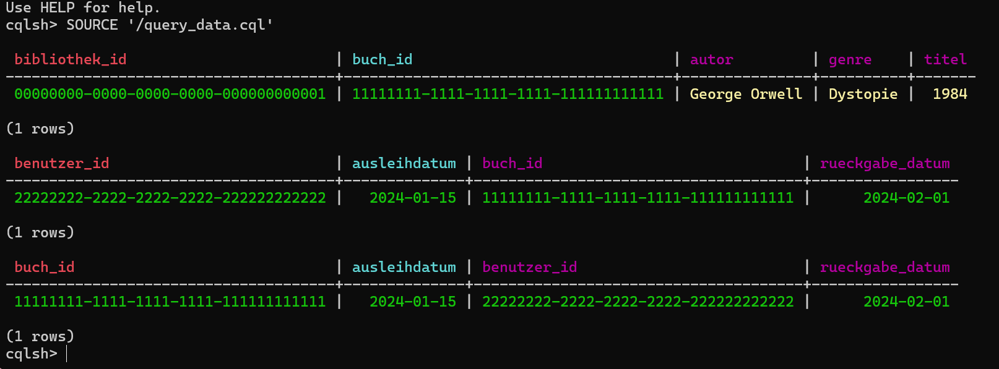
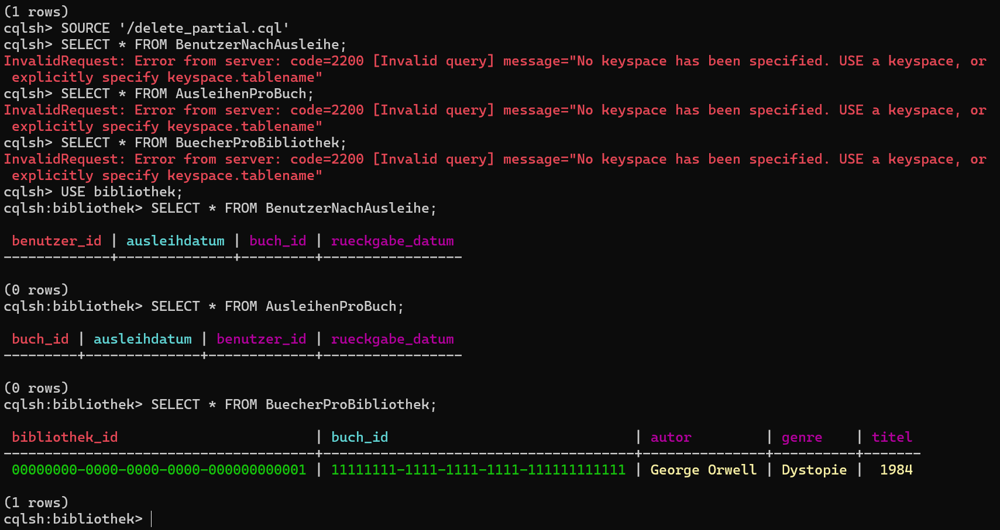
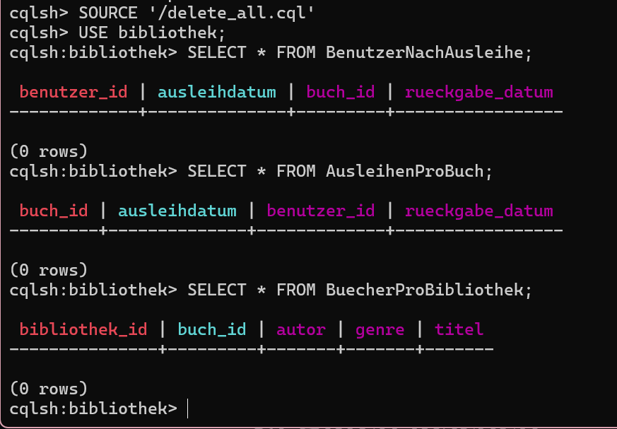
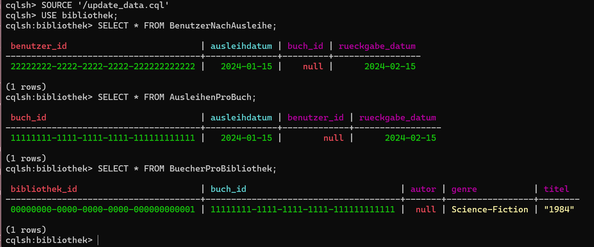

# A) Daten hinzufügen

Eine Skript-Datei (.txt), die die Befehle enthält. Die Datei sollte einfach ausführbar sein, ohne dass  Änderungen notwendig sind. Die Skript-Datei ist so formatiert, dass Sie von Auge lesbar ist (z.B. nicht alles auf einer Zeile)

[Skript Datei](insert_data.cql)

Screenshot, der zeigt, dass Sie die Abfragen ausführen konnten.

# B) Daten abfragen

Eine Skript-Datei (.txt), die die Befehle enthält. Die Datei sollte einfach ausführbar sein, ohne dass  Änderungen notwendig sind. Die Skript-Datei ist so formatiert, dass Sie von Auge lesbar ist (z.B. nicht alles auf einer Zeile)

[Skript Datei](query_data.cql)

Screenshot, der zeigt, dass Sie die Abfragen ausführen konnten.

# C) Daten löschen

Eine Skript-Datei (.txt), die die Befehle enthält. Die Datei sollte einfach ausführbar sein, ohne dass  Änderungen notwendig sind. Die Skript-Datei ist so formatiert, dass Sie von Auge lesbar ist (z.B. nicht alles auf einer Zeile)

[Skript Datei](delete_partial.cql)

Eine Skript-Datei (.txt), die alle Daten löscht.

[Skript Datei](delete_all.cql)

Screenshot, der zeigt, dass Sie die Abfragen ausführen konnten.

Delete Partial

Delete All

# D) Daten verändern

Beschreibungen der 3 Szenarien

1.  In der Bibliothek Basel wurde der Titel eines Buchs falsch gespeichert. „1984“ sollte in Anführungszeichen stehen, da es sich um einen Buchtitel handelt.

2. Benutzerin Anna hat das Buch verlängert, daher muss das Rückgabedatum geändert werden.

3. Das Buch „1984“ wurde fälschlich als „Dystopie“ eingetragen. Es soll nun als „Science-Fiction“ klassifiziert werden.

Eine Skript-Datei (.txt), die die Befehle enthält. Die Datei sollte einfach ausführbar sein, ohne dass  Änderungen notwendig sind. Die Skript-Datei ist so formatiert, dass Sie von Auge lesbar ist (z.B. nicht alles auf einer Zeile)

[Skript Datei](update_data.cql)

Screenshot, der zeigt, dass Sie die Abfragen ausführen konnten.

