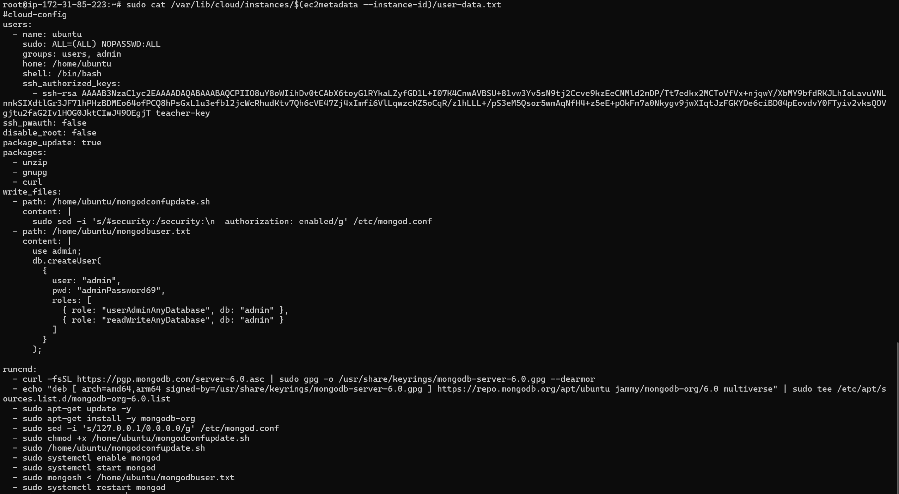
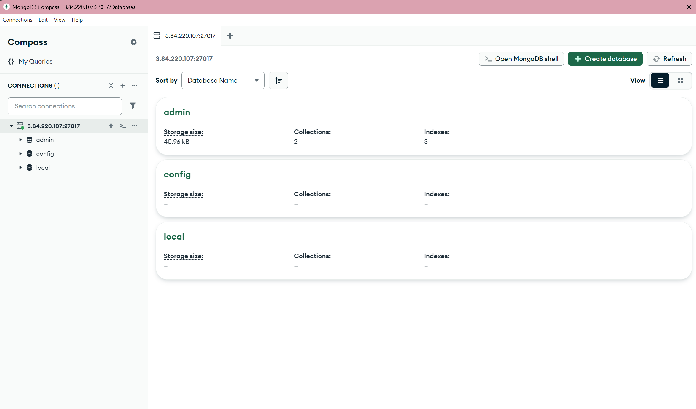
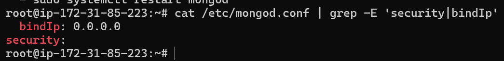
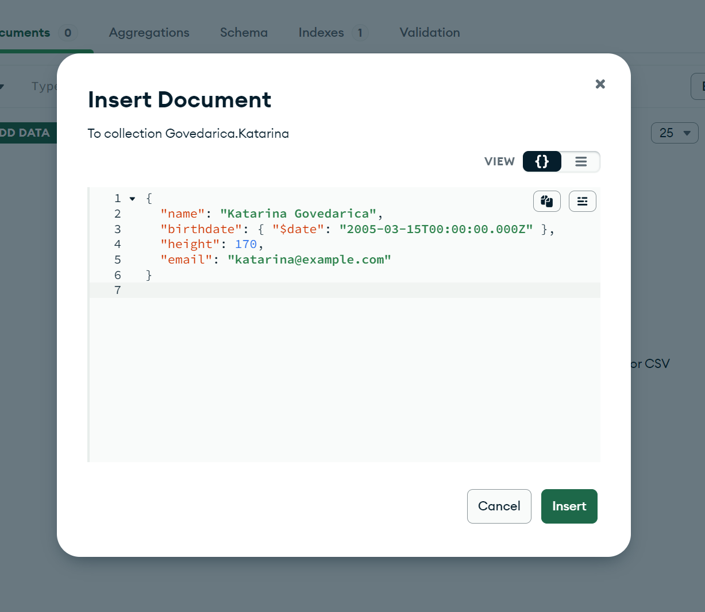
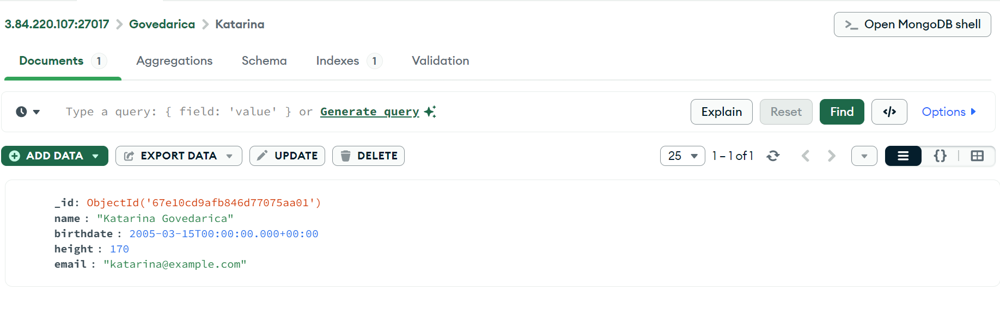

## A) Installation
- Ihre Cloud-Init Datei mit dem geänderten Passwort:

und hier nochmal als [Datei](cloudinit-mongodb.yaml)

- Screenshot von Compass mit der Liste der bereits bestehenden Datenbanken:

- Schauen Sie sich Ihren Connection String an. Erklären Sie was die Option authSource=admin macht und wieso dieser Parameter so korrekt ist.  (Schauen Sie in den Quellen nach):

authSource=admin bedeutet, dass die Authentifizierung gegen die "admin"-Datenbank erfolgt.
Mein Admin-User wurde in admin erstellt- Ohne authSource=admin könnte MongoDB nach dem User in einer falschen DB suchen.

- Im cloud-init finden Sie zweimal den Linux Befehle sed.
Erklären Sie was die beiden Befehle bewirken. (Schauen Sie in den Quellen nach). Sie sollen erklären wieso die beiden Befehle notwendig sind, resp. was der Einfluss auf unsere MongoDB ist:

**sudo sed -i 's/#security:/security:\n  authorization: enabled/g' /etc/mongod.conf**
Sucht nach #security: in der Datei /etc/mongod.conf und ersetzt es durch: 
**security:
  authorization: enabled**
Dadurch wird es aktiviert das man sich mit einem Passwort authentifizieren muss.

**sudo sed -i 's/127.0.0.1/0.0.0.0/g' /etc/mongod.conf**
Sucht in /etc/mongod.conf nach 127.0.0.1 (nur lokale Verbindungen) und ersetzt es durch 0.0.0.0.
Dadurch wird MongoDB für externe Verbindungen geöffnet.
Wichtig sonst ist es ein Sicherheitsrisiko wenn die Firewall nicht richtig konfiguriert ist

- Zeigen Sie mit einem Screenshot den Inhalt der MongoDB Konfigurations-Datei in dem die beiden ersetzten Werte sichtbar sind. Sie können die Datei z.B. mit nano öffnen oder mit cat den Inhalt anzeigen lassen und mit grep filtern.

## B) Erste Schritte GUI

- Screenshot (oder JSON) Ihres einzufügenden Dokuments (bevor Sie es einfügen)

- Screenshot Ihrer Compass-Applikation mit der Datenbank, Collection und Dokument sichtbar, nachdem Sie den Datentyp geändert haben.

- Export-Datei und Erklärung zu dem Datentyp mit möglichen Implikationen auf andere Datentypen. Wieso ist dieser komplizierte Weg notwendig, um ein Datum zu definieren?

[Exported JSON File](Govedarica.Katarina.json)

Damit birthdate als echtes Datum erkannt wird (und nicht als String), muss man es im Format "$date" angeben. MongoDB Compass speichert neue Felder sonst als Text. Der Export zeigt, wie das Datum richtig aussehen muss, damit man z. B. nach Jahren filtern kann. Deshalb ist dieser Weg notwendig.
