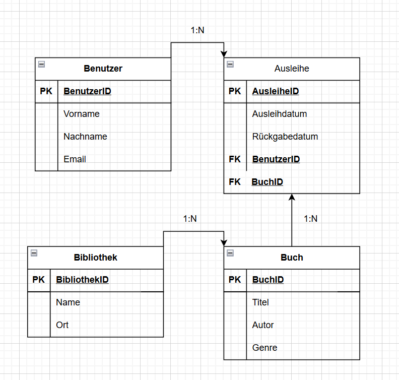
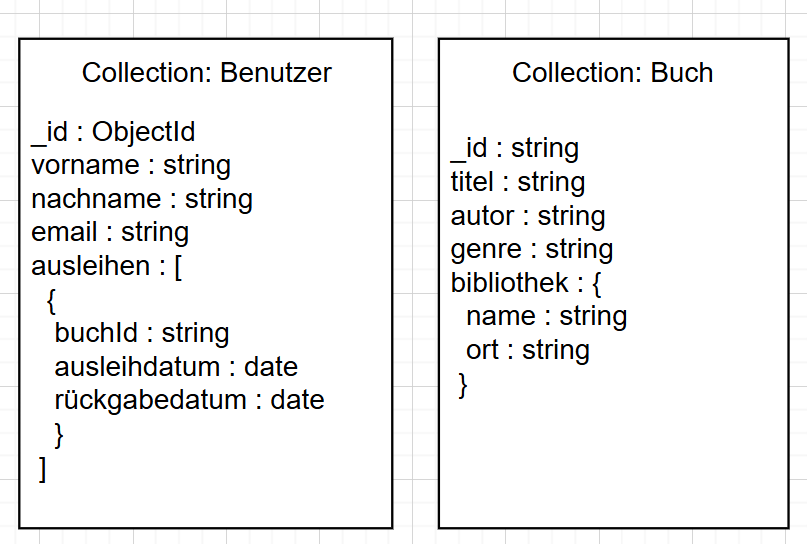

## A) Konzeptionelles Datenmodell

- Draw.io Diagramm (oder ähnliches Tool) des konzeptionellen Diagramms
[Datei](KN-02.drawio)

- Bild des konzeptionellen Diagramms.

- Kurze textuelle Erklärungen zu den Entitäten und Beziehungen.

**- Benutzer**: Ein Benutzer ist eine Person, die Bücher ausleihen kann. Zu jedem Benutzer werden der Vorname, Nachname und die E-Mail-Adresse gespeichert. Jeder Benutzer kann mehrere Bücher ausleihen.

**-Buch**: Ein Buch ist ein ausleihbares Medium. Es hat einen Titel, einen Autor und ein Genre. Jedes Buch gehört zu genau einer Bibliothek und kann von mehreren Benutzern ausgeliehen werden.

**-Bibliothek**: Eine Bibliothek ist ein Ort, an dem Bücher zur Verfügung stehen. Sie hat einen Namen und befindet sich an einem bestimmten Ort. Eine Bibliothek kann mehrere Bücher enthalten.

**-Ausleihe**: Die Entität Ausleihe bildet die Beziehung zwischen einem Benutzer und einem Buch ab. Sie enthält zusätzlich das Ausleihdatum und das Rückgabedatum. Über diese Entität wird eine N:N-Beziehung zwischen Benutzer und Buch dargestellt.

**Benutzer ↔ Ausleihe (1:N)**
Ein Benutzer kann viele Ausleihen tätigen, aber jede Ausleihe gehört genau zu einem Benutzer.

**Buch ↔ Ausleihe (1:N)**
Ein Buch kann mehrmals ausgeliehen werden, aber jede Ausleihe bezieht sich nur auf ein bestimmtes Buch.

**Bibliothek ↔ Buch (1:N)**
Eine Bibliothek besitzt mehrere Bücher, aber jedes Buch gehört nur zu einer Bibliothek.

## B) Logisches Modell für MongoDB

- Ein Bild des logischen Datenmodells.

- Die Original-Datei des logischen Datenmodells (z.B. draw.io)
[Datei](logischessdatenmodell.drawio)

- Erklärung zu Verschachtelungen. wieso haben Sie Ihre Variante gewählt.

**Ausleihe/Benutzer**

Ich hab bei Benutzer die Ausleihen direkt mit reingeschrieben, weil das logisch ist.
Wenn man wissen will, was ein Benutzer ausgeliehen hat, muss man nicht extra in eine andere Liste schauen – alles ist direkt bei ihm gespeichert.
Das ist einfacher und schneller, wenn man z. B. das Profil vom Benutzer aufruft.

**Bibliothek/Buch**
Jedes Buch gehört nur zu einer Bibliothek, und die Infos zur Bibliothek ändern sich fast nie.
Deshalb hab ich das einfach ins Buch reingeschrieben.
Dann weiß man gleich, wo das Buch steht, ohne dass man nochmal eine andere Liste durchsuchen muss.
