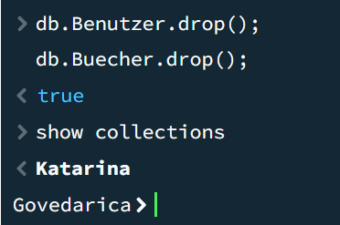
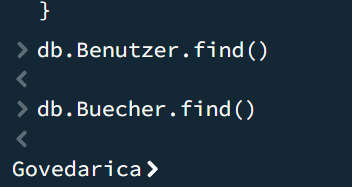

# A) Daten hinzufügen

Eine Skript-Datei (.js), die die Befehle enthält. Die Datei sollte einfach ausführbar sein, ohne dass  Änderungen notwendig sind. Die Skript-Datei ist so formatiert, dass Sie von Auge lesbar ist (z.B. nicht alles auf einer Zeile)

[Skript Datei](insertData.js)

Screenshot, der zeigt, dass Sie die Abfragen ausführen konnten.

# B) Daten löschen

Skript 1, welches alle Collections löscht.

[Skript Datei](delete_all.js)

Skript 2, welches Daten teilweise löscht.

[Skript Datei](delete_partial.js)

Screenshots, die zeigen, dass Sie die Abfragen ausführen konnten.

Delete All

Delete Partial

# C) Daten abfragen

Eine Skript-Datei, mit den Abfragen.

[Skript Datei](query_data.js)

Screenshot, der zeigt, dass Sie die Abfragen ausführen konnten.

