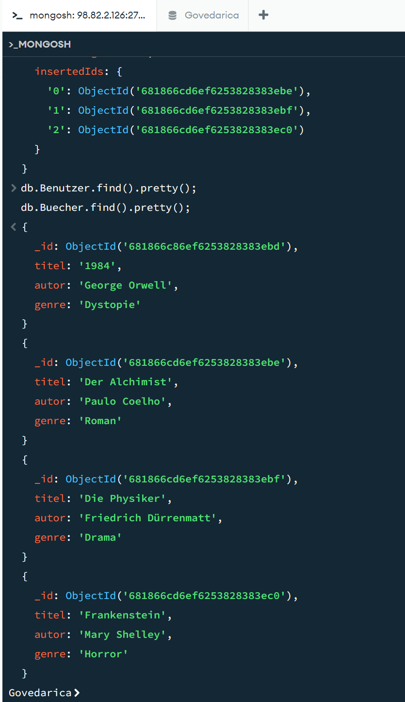

# A) Daten hinzufügen

Eine Skript-Datei (.js), die die Befehle enthält. Die Datei sollte einfach ausführbar sein, ohne dass  Änderungen notwendig sind. Die Skript-Datei ist so formatiert, dass Sie von Auge lesbar ist (z.B. nicht alles auf einer Zeile)
[Skript Datei](insertData.js)

Screenshot, der zeigt, dass Sie die Abfragen ausführen konnten.

